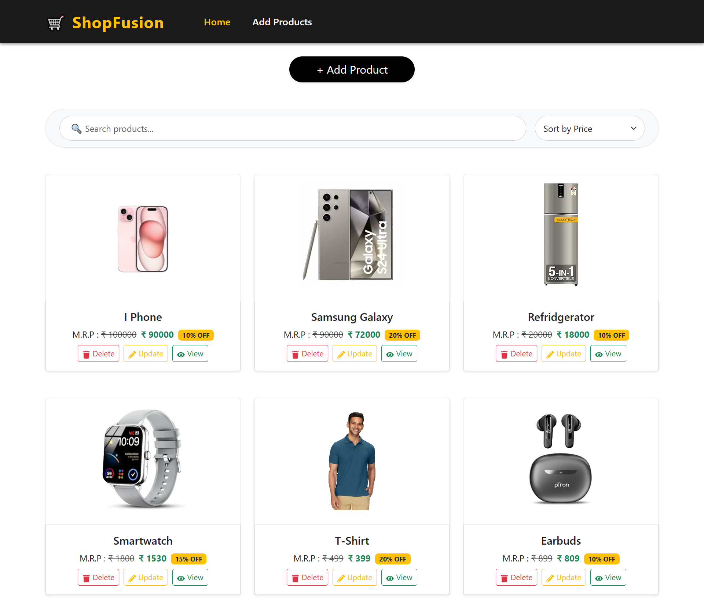
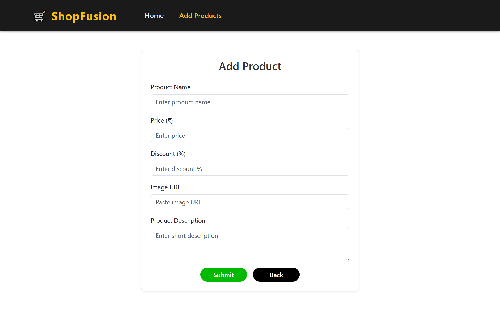
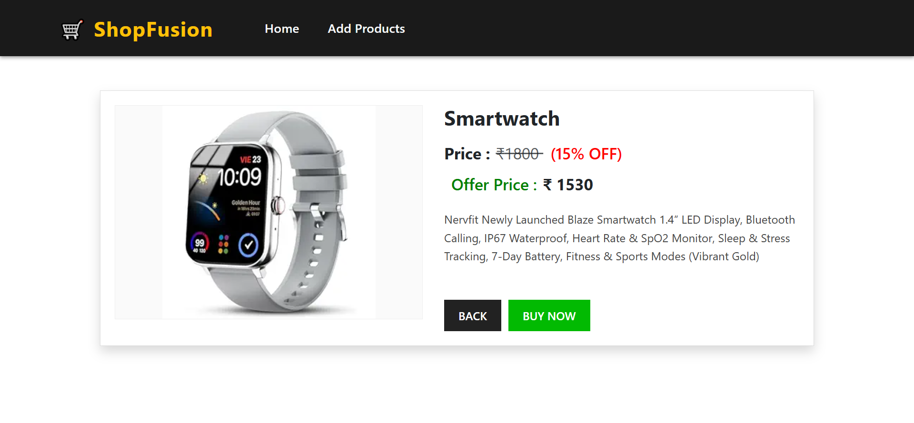

# 🛒 E-Commerce Functionality App

This project is a **Multi-Page E-Commerce Functionality Application** built using **React** and **Bootstrap**.  
Users can **add, view, update, delete, search, and sort products**, just like on platforms such as **Amazon or Flipkart**.  
All products are stored in a mock API, the **discounted price is calculated automatically**, and users can **search or sort products by name, price, or discount**.

---

## 🚀 Features
- Add new products with:
  - Name, Price, Discount %, Description, and Image URL
- View all products as cards on the Home page
- Automatically shows **discounted price**
- Update or delete any product directly from the card
- View detailed product page with full description
- **Search products by name** from the product list
- **Sort products** by:
  - Price (Low → High / High → Low)
  - Discount (Low → High / High → Low)

---

## 🛠️ Tech Stack

    
  <b>React</b> — Component-based frontend library for building UI  
    
  
    
  <b>Bootstrap</b> — CSS framework for responsive layouts  
    
  
    
  <b>CSS3</b> — Styling and layout with custom designs  
    

    
  <b>API</b> — Mock API for storing and managing product data  

---

## 📸 Project Preview
### 🏠 Home Page

### ➕ Add Product Page

### 🔍 View Product Page

